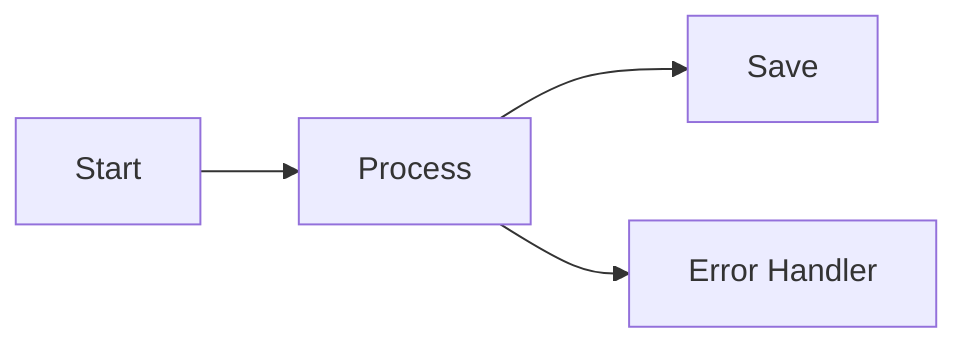

# Flyt

A simple workflow framework for Go - like connecting LEGO blocks where each block does one specific job.

**Flyt** (Norwegian for "flow") is inspired by [Pocket Flow](https://github.com/The-Pocket/PocketFlow), bringing the same simplicity and elegance to Go with zero dependencies.

## What is Flyt?

Think of Flyt as a way to organize tasks that need to happen in a specific order, like a recipe or assembly instructions. It breaks complex workflows into simple, reusable pieces.

## Installation

```bash
go get github.com/mark3labs/flyt
```

## The Building Blocks

### 1. **Node** - The Basic Task Unit
A Node is like a single worker that does ONE specific job. It has three phases:


- **PREP**: "What do I need?" - Gathers inputs from the shared storage
- **EXEC**: "Do the work!" - Actually performs the task
- **POST**: "What's next?" - Saves results and decides what happens next

### 2. **SharedStore** - The Shared Notebook
A thread-safe storage that all nodes can read from and write to:

```go
store := flyt.NewSharedStore()
store.Set("username", "John")     // Write
name, _ := store.Get("username")  // Read
```

### 3. **Flow** - The Task Organizer
Connects nodes together like a flowchart:



### 4. **Action** - The Decision Maker
After each node finishes, it returns an "Action" that determines what happens next:
- `"default"` = continue to the next node
- Custom actions = branch to different nodes

## Quick Example - AI Email Assistant

```go
package main

import (
    "context"
    "fmt"
    "os"
    
    "github.com/mark3labs/flyt"
    "github.com/openai/openai-go"
    "github.com/openai/openai-go/option"
)

// Initialize OpenAI client
var aiClient = openai.NewClient(
    option.WithAPIKey(os.Getenv("OPENAI_API_KEY")), // Set your API key
)

// Define nodes (workers)
type AnalyzeEmailNode struct {
    *flyt.BaseNode
}

func (n *AnalyzeEmailNode) Prep(ctx context.Context, store *flyt.SharedStore) (any, error) {
    email, _ := store.Get("email_text")
    return email, nil
}

func (n *AnalyzeEmailNode) Exec(ctx context.Context, prepResult any) (any, error) {
    email := prepResult.(string)
    
    // Call OpenAI to analyze email sentiment
    completion, err := aiClient.Chat.Completions.New(ctx, openai.ChatCompletionNewParams{
        Messages: []openai.ChatCompletionMessageParamUnion{
            openai.UserMessage(fmt.Sprintf(
                "Analyze this email sentiment. Reply with only one word: positive, negative, or neutral.\n\nEmail: %s", 
                email,
            )),
        },
        Model: openai.ChatModelGPT4oMini,
    })
    if err != nil {
        return nil, err
    }
    
    sentiment := completion.Choices[0].Message.Content
    return sentiment, nil
}

func (n *AnalyzeEmailNode) Post(ctx context.Context, store *flyt.SharedStore, prep, exec any) (flyt.Action, error) {
    sentiment := exec.(string)
    store.Set("sentiment", sentiment)
    
    // Branch based on sentiment
    if sentiment == "negative" {
        return "urgent_response", nil
    }
    return "normal_response", nil
}

type GenerateResponseNode struct {
    *flyt.BaseNode
    urgent bool
}

func (n *GenerateResponseNode) Prep(ctx context.Context, store *flyt.SharedStore) (any, error) {
    email, _ := store.Get("email_text")
    return email, nil
}

func (n *GenerateResponseNode) Exec(ctx context.Context, prepResult any) (any, error) {
    email := prepResult.(string)
    
    // Generate appropriate response
    responseType := "professional and friendly"
    if n.urgent {
        responseType = "urgent, empathetic, and helpful"
    }
    
    completion, err := aiClient.Chat.Completions.New(ctx, openai.ChatCompletionNewParams{
        Messages: []openai.ChatCompletionMessageParamUnion{
            openai.SystemMessage(fmt.Sprintf("You are a helpful customer service agent. Write a %s email response.", responseType)),
            openai.UserMessage(fmt.Sprintf("Customer email: %s", email)),
        },
        Model: openai.ChatModelGPT4oMini,
    })
    if err != nil {
        return nil, err
    }
    
    return completion.Choices[0].Message.Content, nil
}

func main() {
    // Create nodes
    analyze := &AnalyzeEmailNode{BaseNode: flyt.NewBaseNode()}
    urgentResponse := &GenerateResponseNode{BaseNode: flyt.NewBaseNode(), urgent: true}
    normalResponse := &GenerateResponseNode{BaseNode: flyt.NewBaseNode(), urgent: false}
    
    // Create flow
    flow := flyt.NewFlow(analyze)
    flow.Connect(analyze, "urgent_response", urgentResponse)
    flow.Connect(analyze, "normal_response", normalResponse)
    
    // Create shared storage
    store := flyt.NewSharedStore()
    store.Set("email_text", "I'm very disappointed with the service...")
    
    // Run it!
    ctx := context.Background()
    if err := flow.Run(ctx, store); err != nil {
        panic(err)
    }
    
    sentiment, _ := store.Get("sentiment")
    fmt.Printf("Email sentiment: %s\n", sentiment) // "negative"
}
```

## Special Features

### Batch Processing
Process many items at once:

```go
// Process files in parallel
processFiles := flyt.NewBatchNode(
    func(ctx context.Context, file any) (any, error) {
        // process each file
        return processFile(file), nil
    }, 
    true, // true = parallel processing
)

store := flyt.NewSharedStore()
store.Set("items", []string{"file1.txt", "file2.txt", "file3.txt"})
```

### Retry Logic
Automatically retry failed operations:

```go
node := flyt.NewBaseNode(
    flyt.WithMaxRetries(3),           // Try 3 times
    flyt.WithWait(time.Second),       // Wait 1 second between tries
)
```

### Timeouts and Cancellation
Set time limits on operations:

```go
ctx, cancel := context.WithTimeout(context.Background(), 5*time.Second)
defer cancel()

err := flow.Run(ctx, store) // Will stop after 5 seconds
```

### Error Handling
Batch operations collect all errors:

```go
_, err := flyt.Run(ctx, batchNode, store)

var batchErr *flyt.BatchError
if errors.As(err, &batchErr) {
    fmt.Printf("Had %d errors\n", len(batchErr.Errors))
}
```

## Common Patterns

### Branching Workflow
```go
// Approval workflow
review := &ReviewNode{BaseNode: flyt.NewBaseNode()}
approve := &ApproveNode{BaseNode: flyt.NewBaseNode()}
reject := &RejectNode{BaseNode: flyt.NewBaseNode()}

flow := flyt.NewFlow(review)
flow.Connect(review, "approve", approve)
flow.Connect(review, "reject", reject)
```

### Worker Pool (Built-in)
```go
config := &flyt.BatchConfig{
    MaxConcurrency: 10, // Use 10 workers
}

node := flyt.NewBatchNodeWithConfig(processFunc, true, config)
```

### Graceful Shutdown
```go
ctx, cancel := context.WithCancel(context.Background())

// Handle shutdown signals
go func() {
    <-signalChannel
    cancel() // This will cancel all running nodes
}()

flow.Run(ctx, store)
```

## Why Use Flyt?

1. **Simple**: Break complex tasks into simple steps
2. **Safe**: Thread-safe for concurrent operations  
3. **Flexible**: Easy branching, retries, and error handling
4. **Testable**: Each node can be tested independently
5. **No Magic**: Just Go interfaces and structs

## Complete Example - File Processing Pipeline

```go
// 1. Read files node
type ReadFilesNode struct {
    *flyt.BaseNode
}

func (n *ReadFilesNode) Exec(ctx context.Context, prep any) (any, error) {
    return []string{"file1.txt", "file2.txt", "file3.txt"}, nil
}

func (n *ReadFilesNode) Post(ctx context.Context, store *flyt.SharedStore, prep, exec any) (flyt.Action, error) {
    store.Set("files", exec)
    return flyt.DefaultAction, nil
}

// 2. Process files in batch
processFunc := func(ctx context.Context, file any) (any, error) {
    filename := file.(string)
    // Process the file
    return fmt.Sprintf("processed_%s", filename), nil
}

// 3. Build the pipeline
readNode := &ReadFilesNode{BaseNode: flyt.NewBaseNode()}
processNode := flyt.NewBatchNode(processFunc, true) // parallel
saveNode := &SaveResultsNode{BaseNode: flyt.NewBaseNode()}

flow := flyt.NewFlow(readNode)
flow.Connect(readNode, flyt.DefaultAction, processNode)
flow.Connect(processNode, flyt.DefaultAction, saveNode)

// 4. Run it
store := flyt.NewSharedStore()
ctx := context.Background()

if err := flow.Run(ctx, store); err != nil {
    log.Fatal(err)
}
```

## License

MIT License - see LICENSE file for details.