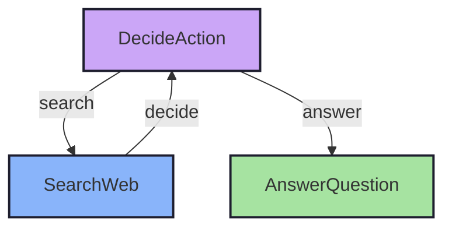

# Flyt Agent Example

This example demonstrates how to build an AI research agent using the Flyt workflow framework. The agent can answer questions by searching the web when needed and generating comprehensive answers.

## Architecture

The agent consists of three main nodes:

1. **DecideActionNode** - Analyzes the question and decides whether to search for more information or provide an answer
2. **SearchWebNode** - Performs web searches to gather information
3. **AnswerQuestionNode** - Generates a final answer based on the gathered information

## Flow Diagram



## Prerequisites

- Go 1.21 or later
- OpenAI API key

## Installation

1. Clone the repository and navigate to the agent example:
```bash
cd cookbook/agent
```

2. Install dependencies:
```bash
go mod tidy
```

This will install:
- `github.com/mark3labs/flyt` - The workflow framework (uses local version)

## Usage

Run the agent with your OpenAI API key:

```bash
# Using environment variables
export OPENAI_API_KEY=your-api-key
export BRAVE_API_KEY=your-brave-key  # Optional for better search results
go run .

# Or using command line flags
go run . -key your-api-key -q "What is the capital of France?"

# With Brave Search for better results
go run . -key your-api-key -brave your-brave-key -q "Latest AI developments"

# If running individual files instead of module:
go run *.go -key your-api-key
```

### Command Line Options

- `-q` : The question to ask the agent (default: "Who won the Nobel Prize in Physics 2024?")
- `-key` : OpenAI API key (can also be set via OPENAI_API_KEY environment variable)
- `-brave` : Brave Search API key (optional, can also be set via BRAVE_API_KEY environment variable)

## Example Output

```
🤔 Processing question: Who won the Nobel Prize in Physics 2024?
🤔 Agent deciding what to do next...
🔍 Agent decided to search for: Nobel Prize Physics 2024 winners
🌐 Searching the web for: Nobel Prize Physics 2024 winners
📚 Found information, analyzing results...
🤔 Agent deciding what to do next...
💡 Agent decided to answer the question
✍️ Crafting final answer...
✅ Answer generated successfully

🎯 Final Answer:
The 2024 Nobel Prize in Physics was awarded to John J. Hopfield and Geoffrey E. Hinton for their foundational discoveries and inventions that enable machine learning with artificial neural networks.

John Hopfield created an associative memory that can store and reconstruct images and other types of patterns in data. Geoffrey Hinton invented a method that can autonomously find properties in data, and so perform tasks such as identifying specific elements in pictures.

Their work has been fundamental to the development of artificial neural networks and machine learning technologies that are widely used today.
```

## How It Works

1. The agent starts at the `DecideActionNode`
2. It analyzes the question and any previous context
3. It decides whether to:
   - Search for more information (goes to `SearchWebNode`)
   - Answer the question (goes to `AnswerQuestionNode`)
4. If searching, it performs a web search and adds results to the context
5. After searching, it returns to `DecideActionNode` to re-evaluate
6. This loop continues until the agent has enough information to answer
7. Finally, it generates a comprehensive answer using all gathered information

## Customization

### Web Search APIs

The agent uses real web search APIs:

1. **DuckDuckGo HTML Search** (Free, no key required)
   - Uses DuckDuckGo's HTML endpoint directly
   - Used by default when no Brave API key is provided

2. **Brave Search API** 
   - Provides structured JSON search results
   - Get a free API key from https://brave.com/search/api/
   - Use via `-brave` flag or `BRAVE_API_KEY` environment variable

### Changing the LLM Model

The agent uses GPT-4.1 by default. To use a different OpenAI model, modify the model parameter in `CallLLM` function:

```go
reqBody := map[string]any{
    "model": "gpt-4.1", // Options: gpt-4.1, gpt-4, gpt-4-turbo, gpt-3.5-turbo
    "messages": []map[string]string{
        {"role": "user", "content": prompt},
    },
    "temperature": 0.7,
}
```

### Adding New Nodes

To extend the agent with new capabilities:

1. Create a new node type implementing the flyt.Node interface
2. Add it to the flow in `flow.go`
3. Update the decision logic to route to your new node

## Error Handling

The agent includes error handling for:
- Missing API keys
- LLM API failures
- Invalid response formats
- Context cancellation

## Performance Considerations

- The agent uses GPT-4.1
- Each decision and answer generation makes a separate LLM call
- Consider implementing caching for repeated queries